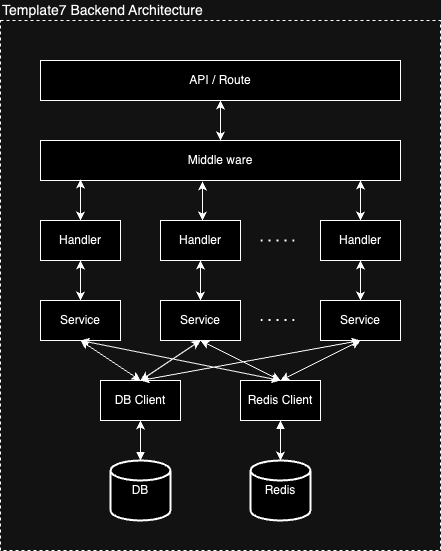

<p>
  
</p>

# Template7-Backend

[](https://github.com/tterb/atomic-design-ui/blob/master/LICENSEs)

Template for REST API server write by go.

<br />

## Architecture

<p >
  
</p>

For clean logic and easy-maintainable purpose, suggest each layer to access its next layer's function / method only,
do not implement cross layer function call.

For example: handler should not access db client directly, have to access by correspond component instead.  

| Layer | Function |
| :--- | :--- |
| API / Route | Registered API endpoint. |
| Middle ware | Common/routine functions such like token verification, body check, etc. |
| Handler | Parse necessary variables from URI or body. |
| Component | Core business logic, include third-party client. |
| DB Client | DB access functions. |
| Redis Client | Redis client. |
| Document / Struct | Definition of DB documents / structs. |

## Build

### Binary Only
```
$ make build
```

### Swagger Document
```
$ make swagger
```

### Run
```
$ make run
```

### All
```
$ make all 
```

## Docker Image

```
$ docker push allensyk/template7-backend:latest
```
